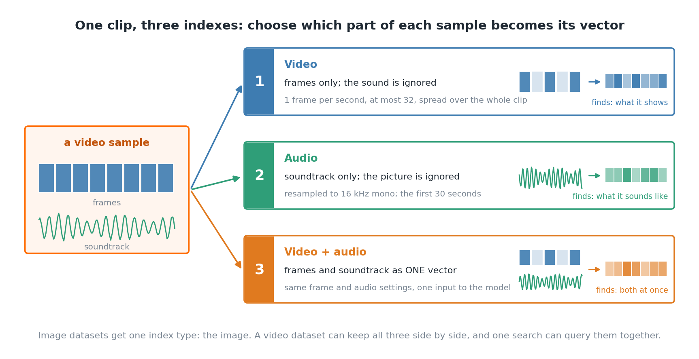
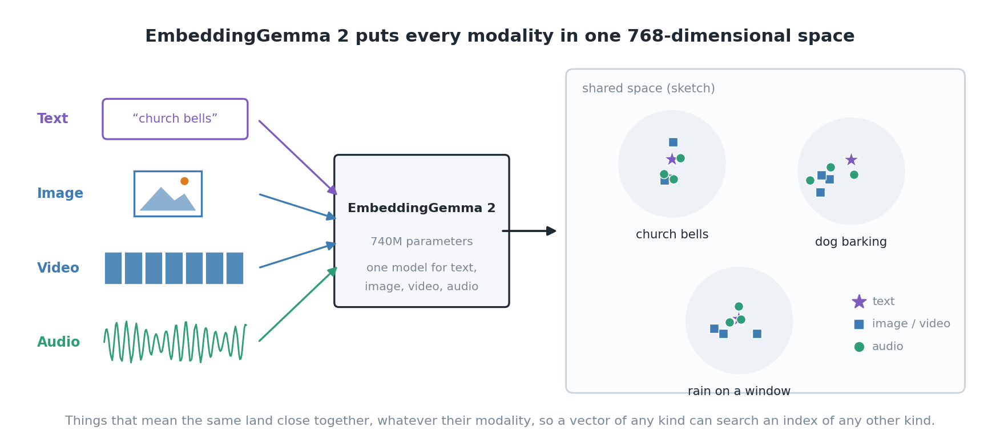
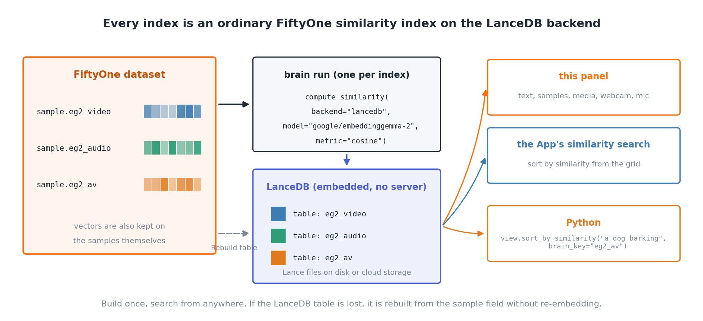
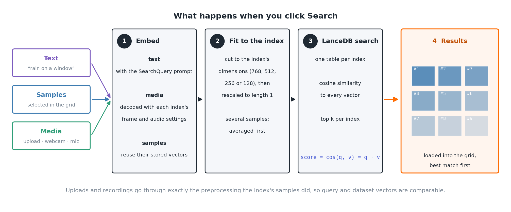
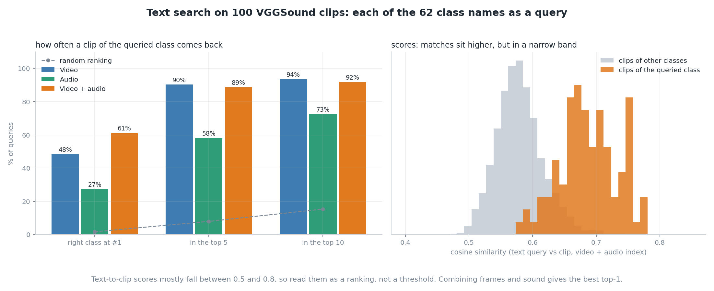
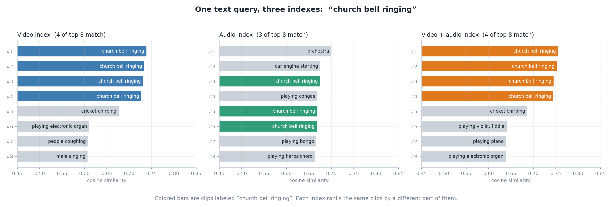
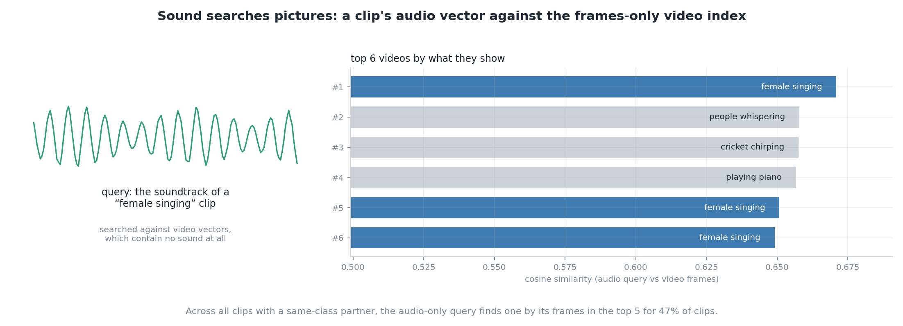

# Cross-Modal Retrieval

<div align="center">
<p align="center">

<!-- prettier-ignore -->
 &nbsp;


**The open-source tool for building high-quality datasets and computer vision
models**

---

<!-- prettier-ignore -->
<a href="https://voxel51.com/fiftyone?utm_source=harpreet-gh">Website</a> •
<a href="https://docs.voxel51.com?utm_source=harpreet-gh">Docs</a> •
<a href="https://colab.research.google.com/github/voxel51/fiftyone-examples/blob/master/examples/quickstart.ipynb?utm_source=harpreet-gh">Try it Now</a> •
<a href="https://docs.voxel51.com/getting_started_guides/index.html?utm_source=harpreet-gh">Getting Started Guides</a> •
<a href="https://docs.voxel51.com/tutorials/index.html?utm_source=harpreet-gh">Tutorials</a> •
<a href="https://voxel51.com/blog/?utm_source=harpreet-gh">Blog</a> •
<a href="https://discord.gg/fiftyone-community?utm_source=harpreet-gh">Community</a>

[](https://discord.gg/fiftyone-community)
[](https://huggingface.co/Voxel51)
[](https://voxel51.com/blog)
[](https://share.hsforms.com/1zpJ60ggaQtOoVeBqIZdaaA2ykyk)
[](https://www.linkedin.com/company/voxel51)
[](https://x.com/voxel51)
[](https://medium.com/voxel51)

</p>
</div>

Search the images, video and audio in a FiftyOne dataset with a sentence, with
other samples, with a file, or with your own webcam and microphone. Type "a dog
barking" and get the clips that sound like it. Record yourself clapping and
find the videos with applause. Pick a clip and find the videos that look like
its sound.

## Install

```shell
fiftyone plugins download https://github.com/harpreetsahota204/cross_modal_retrieval_plugin
fiftyone plugins requirements @harpreetsahota/cross-modal-retrieval --install
```

Then register the model once:

```python
import fiftyone.zoo as foz

foz.register_zoo_model_source("https://github.com/harpreetsahota204/EmbeddingGemma2")
```

The weights download the first time you build an index or search. The model
runs on CPU, but embedding a video dataset is much faster on a GPU.

## Quick start

1. Open a dataset in the App and click the `+` next to the grid's tab, then
   **Cross-Modal Search**
2. Click **Build Cross-Modal Index**, choose what to embed the samples as, and
   run it
3. Click **New Search**, type a description, and click **Search**

The matches open in the grid, best first.

## Using the panel

The panel is laid out like FiftyOne's own Similarity Search panel. Its home
page lists your saved searches; **New Search** opens the search form and the
gear button lists your indexes.

### 1. Build an index

An index is the set of vectors your queries are compared to. Build your first
one with **Build Cross-Modal Index**; add more later from the gear button with
**+ Similarity Index**. When you build one, you choose which part of each
sample becomes its vector:

<picture>
  <source media="(prefers-color-scheme: dark)" srcset="figures/02_index_modalities_dark.png">
  
</picture>

| Embed the samples as | What goes into the vector | Finds samples by |
|---|---|---|
| Image | the image | what they show |
| Video | frames sampled from the video; the sound is ignored | what they show |
| Audio | the soundtrack, or the audio file | what they sound like |
| Video + audio | frames and soundtrack together, as one vector | both at once |

A video dataset can have a video, an audio and a video + audio index side by
side, and one search can query all three.

The build form also asks for:

- **Dimensions**: 768, 512, 256 or 128. Smaller vectors are faster to search
  and take less space; 128 loses noticeable quality
- **Frames per second** and **Max frames** (video): how frames are sampled.
  The default is one frame per second, capped at 32 frames spread over the
  whole clip
- **Max audio seconds** (audio): how much of the sound is used. The default is
  the first 30 seconds

Building runs in the background if you have delegated operations set up.

### 2. Search

Click **New Search**. Under **Search against**, pick one or more indexes; each
returns its own matches. Then choose what to search with:

- **Text**: describe what you want to find: "rain on a window", "a crowd
  cheering", "a red car at night"
- **Samples**: select samples in the grid first. Several samples are averaged
  into one query, so selecting three dogs barking finds "dogs barking" better
  than one example does. The selected samples are left out of the results
- **Media**: use something that isn't in the dataset. Click **Upload** to pick
  an image, video, audio or MCAP file, or use **Webcam** or **Microphone** to
  record a clip of up to 30 seconds. The webcam can also take a photo.
  Nothing you upload or record is added to the dataset

For Samples and Media, **Embed your query as** chooses which part of the query
becomes its vector. A video clip can be searched by its frames, its sound, or
both. This is where cross-modal search gets interesting: search an audio
index with the frames of a video to find what *sounds* like what it *shows*.

Set **Number of matches** (per index), optionally name the search, and click
**Search**.

The webcam and microphone need the App on `localhost` or https, which is a
browser rule. The browser asks for permission the first time.

### 3. Work with results

The matches load into the grid in rank order. Every search is saved to the
panel's home page, where you can:

- Click a search to show its results again. A search of several indexes has a
  button per index
- **Clone** a search to tweak it and run it again
- **Delete** searches you no longer need

## How it works

### The model: EmbeddingGemma 2

[EmbeddingGemma 2](https://huggingface.co/google/embeddinggemma-2) is a
740M-parameter embedding model from Google DeepMind. It turns text, images,
video and audio into vectors in **one shared 768-dimensional space**. In that
space, the vector for the words "a dog barking", the vector for a photo of a
barking dog, and the vector for the sound of a bark all land near each other.

<picture>
  <source media="(prefers-color-scheme: dark)" srcset="figures/01_shared_space_dark.png">
  
</picture>

That shared space is what makes cross-modal search possible. Any vector can be
compared to any other, so a text query can search audio, and the sound of one
clip can search the frames of every other clip.

Two details matter for search quality:

- **Retrieval prompts.** Text queries are prefixed with the model's
  `SearchQuery` prompt, which tells it the text is a search query rather than
  a document. This improves retrieval
- **Matryoshka dimensions.** The model is trained so the first 512, 256 or 128
  numbers of a vector are a usable embedding on their own. That's what the
  **Dimensions** option uses: smaller indexes without retraining anything

The model is integrated as a
[FiftyOne remote zoo model](https://github.com/harpreetsahota204/EmbeddingGemma2),
which handles decoding: video frames are sampled by timestamp with PyAV, and
audio is resampled to 16 kHz mono.

### Why LanceDB

[LanceDB](https://lancedb.com/) is an open-source vector database that suits
multimodal embeddings well:

- **Embedded, no server.** It runs inside the FiftyOne process and stores
  tables as files, on local disk or in cloud storage. There's nothing to
  deploy or keep running
- **Built for ML data.** Tables use the Lance columnar format, designed for
  fast random access to large vectors and the metadata stored next to them
- **Scales past memory.** Tables live on disk, so an index doesn't have to fit
  in RAM, and approximate indexes can be added when tables get large
- **Many tables, one store.** Each index is its own table, so image, video,
  audio and video + audio indexes of the same dataset sit side by side
  without interfering

### FiftyOne's LanceDB integration

FiftyOne Brain has LanceDB as a built-in
[similarity backend](https://docs.voxel51.com/brain.html#similarity). Each
index this panel builds is an ordinary FiftyOne similarity index made with
`fob.compute_similarity(..., backend="lancedb")`. So beyond this panel:

<picture>
  <source media="(prefers-color-scheme: dark)" srcset="figures/04_lancedb_fiftyone_dark.png">
  
</picture>


- The App's own similarity search and `view.sort_by_similarity()` work on
  these indexes
- Indexes you make in Python with this model show up in the panel too (see
  below)
- The vectors are also stored in a field on each sample, so a lost LanceDB
  table can be rebuilt without re-embedding anything

### What happens when you search

<picture>
  <source media="(prefers-color-scheme: dark)" srcset="figures/03_search_pipeline_dark.png">
  
</picture>

1. **Your query becomes a vector.** Text is embedded with the retrieval
   prompt. Selected samples reuse the vectors already stored on them when an
   index of the chosen modality exists, and are embedded on the spot
   otherwise. Uploads and recordings are decoded and embedded **with the
   same settings each index was built with** (frame rate, frame cap, audio
   length), so a query goes through exactly the same preprocessing as the
   samples it's compared to
2. **The vector is fitted to each index.** It's cut to the index's
   dimensions and re-normalized to length 1. Several selected samples are
   averaged first, then normalized
3. **LanceDB finds the nearest vectors.** For each index, LanceDB compares the
   query to every vector in the table by **cosine similarity**, the cosine of
   the angle between two vectors. 1 means they point the same way, 0 means
   unrelated
4. **The top matches open in the grid**, ordered from most to least similar

## How well it works

These numbers come from a 100-clip sample of
[VGGSound](https://www.robots.ox.ac.uk/~vgg/data/vggsound/) with 62 sound
classes. Each class name was used as a text query against the three indexes:

<picture>
  <source media="(prefers-color-scheme: dark)" srcset="figures/05_retrieval_quality_dark.png">
  
</picture>

- **Video + audio is the best all-rounder.** It puts a clip of the right
  class first for 61% of queries, against 48% for video and 27% for audio.
  Random ranking would manage about 2%
- **Frames carry a lot.** VGGSound labels are sounds, yet the video index
  finds a clip of the class in its top 5 for 90% of queries
- **Read scores as a ranking.** Text-to-clip scores sit in a narrow band
  (roughly 0.5 to 0.8), and matches score only about 0.1 higher than other
  clips. Compare scores within one search, not across searches

Different indexes rank the same clips by different evidence:

<picture>
  <source media="(prefers-color-scheme: dark)" srcset="figures/06_example_search_dark.png">
  
</picture>

And because everything shares one space, a clip's *sound* can search other
clips' *pictures*:

<picture>
  <source media="(prefers-color-scheme: dark)" srcset="figures/07_sound_to_frames_dark.png">
  
</picture>

The figures are made by `figures/make_figures.py`.

## Indexes made in Python

The panel picks up any LanceDB index made with this model:

```python
import fiftyone.brain as fob

fob.compute_similarity(
    dataset,
    model="google/embeddinggemma-2",
    model_kwargs={"media_type": "video", "modalities": ["vision", "audio"]},
    embeddings="eg2_av",
    backend="lancedb",
    brain_key="eg2_av",
)
```

`model_kwargs` tells the panel what the index holds. `media_type` is
`image`, `video` or `audio`, and `modalities=["vision", "audio"]` on a video
index means video + audio.

## Where the vectors live

FiftyOne's LanceDB backend doesn't save its storage location with an index,
so every load uses the location in your brain config, which defaults to
`/tmp/lancedb`. Many systems clear `/tmp` on restart, so set somewhere
permanent in `~/.fiftyone/brain_config.json`:

```json
{
    "similarity_backends": {
        "lancedb": {"uri": "~/fiftyone/lancedb"}
    }
}
```

If a table does go missing, the panel flags the index. Open the indexes page
with the gear button and click **Rebuild table** to recreate it from the
vectors stored on the samples.

## Operators

The plugin also adds two operators you can run from the operator browser or
from Python:

| Operator | What it does |
|---|---|
| `build_index` | Embeds the samples and creates a LanceDB index. Can run delegated |
| `search` | Searches indexes with text or the selected samples and returns the matches |

## License

Apache 2.0. The EmbeddingGemma 2 weights are released under
[Apache 2.0](https://huggingface.co/google/embeddinggemma-2); use must follow
the [Gemma Prohibited Use Policy](https://ai.google.dev/gemma/prohibited_use_policy).
